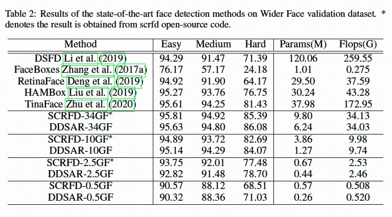

## Introduction

DamoFD introduces a novel DDSAR-score to characterize backbone stage-level detection ability, based on which and SCRFD detection framework, a sota family-based backboen architectures are searched automatically. Now, our paper is accepted by [ICLR-2023](https://openreview.net/pdf?id=NkJOhtNKX91).

Quickly Start on [EasyFace](https://github.com/ly19965/EasyFace/tree/master/face_project/face_detection/DamoFD)。

## Performance

Precision, flops are both evaluated on **VGA resolution**.


## Installation

Please refer to [mmdetection](https://github.com/open-mmlab/mmdetection/blob/master/docs/en/get_started.md#installation) for installation.
 
  1. Install [mmcv](https://github.com/open-mmlab/mmcv). (mmcv-full==1.2.6 and 1.3.3 was tested)
  2. Install build requirements and then install mmdet.
       ```
       pip install -r requirements/build.txt
       pip install -v -e .  # or "python setup.py develop"
       ```

## Data preparation

### WIDERFace:
  1. Download WIDERFace datasets and put it under `data/retinaface`.
  2. Download annotation files from [gdrive](https://drive.google.com/file/d/1UW3KoApOhusyqSHX96yEDRYiNkd3Iv3Z/view?usp=sharing) and put them under `data/retinaface/`
 
   ```
     data/retinaface/
         train/
             images/
             labelv2.txt
         val/
             images/
             labelv2.txt
             gt/
                 *.mat
             
   ```
 

#### Annotation Format 

*please refer to labelv2.txt for detail*

For each image:
  ```
  # <image_path> image_width image_height
  bbox_x1 bbox_y1 bbox_x2 bbox_y2 (<keypoint,3>*N)
  ...
  ...
  # <image_path> image_width image_height
  bbox_x1 bbox_y1 bbox_x2 bbox_y2 (<keypoint,3>*N)
  ...
  ...
  ```
Keypoints can be ignored if there is bbox annotation only.


## Training

Example training command, with 4 GPUs:
```
CUDA_VISIBLE_DEVICES="0,1,2,3" PORT=29701 bash ./tools/dist_train.sh ./configs/scrfd/scrfd_1g.py 4
```

## WIDERFace Evaluation

We use a pure python evaluation script without Matlab.

```
GPU=0
GROUP=scrfd
TASK=scrfd_2.5g
CUDA_VISIBLE_DEVICES="$GPU" python -u tools/test_widerface.py ./configs/"$GROUP"/"$TASK".py ./work_dirs/"$TASK"/model.pth --mode 0 --out wouts
```


## Pretrained-Models

|      Name      | Easy  | Medium | Hard  | FLOPs | Params(M) |  Link                                                         |
| :------------: | ----- | ------ | ----- | ----- | --------- |  ------------------------------------------------------------ |
|   DamoFD_0.5G  | 90.32 | 88.36  | 71.03 | 520M  | 0.26      |  [download](https://drive.google.com/drive/folders/1WbPKfsQ3G9j7c-kxLIQddQ6W7xK8mAQ_?usp=share_link) |
|   DamoFD_2.5G  | 92.82 | 91.48  | 78.70 | 2.46G | 0.44      |  [download](https://drive.google.com/drive/folders/1WbPKfsQ3G9j7c-kxLIQddQ6W7xK8mAQ_?usp=share_link) |
|   DamoFD_10G   | 95.14 | 94.29  | 84.07 | 9.74G | 1.27      |  [download](https://drive.google.com/drive/folders/1WbPKfsQ3G9j7c-kxLIQddQ6W7xK8mAQ_?usp=share_link) |
|   DamoFD_34G   | 95.63 | 94.80  | 85.08 | 34.03G| 6.24      |  [download](https://drive.google.com/drive/folders/1WbPKfsQ3G9j7c-kxLIQddQ6W7xK8mAQ_?usp=share_link) |
|   DamoFD_0.5G_KPS  | 90.41 | 88.45 | 69.97 | 593M  | 0.27   |  [EasyFace](https://github.com/ly19965/EasyFace/tree/master/face_project/face_detection/DamoFD) |
|   DamoFD_2.5G_KPS  | 93.25 | 91.85 | 78.17 | 2.53G | 0.45   |  [EasyFace](https://github.com/ly19965/EasyFace/tree/master/face_project/face_detection/DamoFD) |
|   DamoFD_10G_KPS   | 95.42 | 94.35 | 83.94 | 9.83G | 1.28   |  [EasyFace](https://github.com/ly19965/EasyFace/tree/master/face_project/face_detection/DamoFD) |
|   DamoFD_34G_KPS   | 95.96 | 95.08 | 86.09 |34.32G | 6.28   |  [EasyFace](https://github.com/ly19965/EasyFace/tree/master/face_project/face_detection/DamoFD) |

mAP, FLOPs are all evaluated on VGA resolution.
``_KPS`` means the model includes 5 keypoints prediction.

## Convert to ONNX

Please refer to `tools/scrfd2onnx.py`

Generated onnx model can accept dynamic input as default.

You can also set specific input shape by pass ``--shape 640 640``, then output onnx model can be optimized by onnx-simplifier.


## Inference

Please refer to `tools/scrfd.py` which uses onnxruntime to do inference.

## Network Search
```
cd DDSAR
sh scripts/DamoFd_500M.sh
```
As mentioned in paper,  we set α to 0.25 when searching DDSAR-500M models. While for DDSAR-2.5G, DDSAR-10G and DDSAR-34G models, we need to find a suitable value of α and add some constraints into search space. Otherwise, some trivial architectures may be searched.

## Acknowledgments

We thank Insighface for the excellent [code base] (https://github.com/deepinsight/insightface/tree/master/detection/scrfd).
